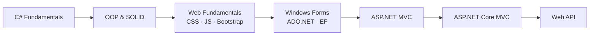

<p align="right"><strong>🇬🇧 English</strong> | <a href="README.tr.md">🇹🇷 Türkçe</a></p>

# 🚀 Skilled Hub 3 — Full Stack .NET Learning Journey

> A complete, hands-on **Full Stack .NET developer** training repository — every project and example, from C# fundamentals all the way to modern ASP.NET Core Web API.

<p align="center">
  
  
  
  
  
  
</p>

---

## 📖 About

This repository brings together all the code examples and mini-projects covered throughout the **Skilled Hub 3** Full Stack .NET training. The content is ordered **from fundamentals to advanced**, so a developer can start from zero and progress step by step:

```
C# Fundamentals  →  Object-Oriented Programming  →  Web Fundamentals  →
Desktop (WinForms + Database)  →  ASP.NET MVC  →  ASP.NET Core MVC  →  Web API
```

Each folder is a self-contained Visual Studio project that demonstrates its topic with isolated examples.

---

## 🗂️ Table of Contents

| # | Section | Description |
|---|---------|-------------|
| 1 | [C# Fundamentals & OOP](#-1-c-fundamentals--object-oriented-programming) | 18 topics from variables to SOLID principles |
| 2 | [Web Fundamentals](#-2-web-fundamentals) | CSS, JavaScript, jQuery, Bootstrap |
| 3 | [Desktop & Database](#-3-desktop-applications--database) | Windows Forms, ADO.NET, Entity Framework CRUD |
| 4 | [ASP.NET MVC](#-4-aspnet-mvc) | .NET Framework & .NET Core MVC |
| 5 | [Web API](#-5-aspnet-core-web-api) | RESTful services |

---

## 🧩 1. C# Fundamentals & Object-Oriented Programming

**18 topics** built as console applications, progressing from the basics of the language to OOP and software design principles:

| Topic | Content |
|-------|---------|
| `Konu01Degiskenler` | Variables and data types |
| `Konu02TipDonusumleri` | Type conversions (casting / parsing) |
| `Konu03Operatorler` | Operators |
| `Konu04KararYapilari` | Decision structures (if / switch) |
| `Konu05Metotlar` | Methods and parameters |
| `Konu06Diziler` | Arrays |
| `Konu07Donguler` | Loops |
| `Konu08SiniflarClasses` | Classes |
| `Konu09StructYapilar` | Structs |
| `Konu10StringSinifi` | String class and its methods |
| `Konu11Enumlar` | Enums |
| `Konu12KalitimInheritance` | Inheritance |
| `Konu13KapsullemeEncapsulation` | Encapsulation |
| `Konu14InterfacesArayuzler` | Interfaces |
| `Konu15AbstractClasses` | Abstract Classes |
| `Konu16CollectionsKoleksiyonlar` | Collections |
| `Konu17HataYonetimi` | Exception Handling |
| `Konu18SOLIDPrensipleri` | SOLID principles |

> Folder names are kept in Turkish (`Konu` = "Topic") as part of the original learning material.

---

## 🎨 2. Web Fundamentals

Under the `WebEgitimi/` folder, **40+ HTML examples** covering the basics of front-end development:

- **CSS** — Backgrounds, margin/padding, sizing, `display`, `position`, `float`, and more
- **JavaScript** — Operators, decision structures, loops, functions, string methods, events, arrays, selectors, DOM
- **jQuery** — Selectors, HTML/CSS manipulation, DOM operations, effects, AJAX
- **Bootstrap** — Grid system, alignment, form elements, components, table classes, and a sample design

---

## 💻 3. Desktop Applications & Database

Building desktop applications with Windows Forms and performing database operations:

| Project | Description |
|---------|-------------|
| `WindowsFormsEgitimi` | Windows Forms basic controls and events |
| `WindowsFormsAppAdoNetCRUD` | CRUD operations directly over SQL using **ADO.NET** |
| `WindowsFormsApp1EntityFrameworkCRUD` | ORM-based CRUD operations using **Entity Framework** |

---

## 🌐 4. ASP.NET MVC

A comparative look at two generations of the MVC framework:

### `NetFrameworkMVCEgitimi` — Classic ASP.NET MVC (.NET Framework 4.x)
Controller / View / Model structure, Razor views, and the classic MVC architecture.

### `NetCoreMVCEgitimi` — Modern ASP.NET Core MVC (.NET 10)
A comprehensive, advanced MVC course spanning **19 controllers**:

- Razor Syntax, HTML Helpers, Data Transfer (ViewBag/ViewData/TempData)
- Model Binding & Model Validation
- **CRUD** operations, Section & Partial Views, View Result types
- File Upload, Cookie & Session management, string formatting
- `appsettings.json` usage, **Filters**, HttpContext
- **Areas** (Admin, Blog, ApiKullanımı), **View Components**

---

## 🔌 5. ASP.NET Core Web API

`AspNetCoreWebAPI/` — Building a **RESTful Web API** on .NET 10:

- Controller-based API structure (`UyelerController`, `WeatherForecastController`)
- HTTP methods (GET / POST / PUT / DELETE)
- Swagger / OpenAPI support

---

## 🛠️ Tech Stack

| Layer | Technologies |
|-------|--------------|
| **Language** | C# |
| **Platform** | .NET 10, .NET Framework 4.7.2 / 4.8 |
| **Web** | ASP.NET Core MVC, ASP.NET MVC, ASP.NET Core Web API |
| **Data** | Entity Framework, ADO.NET |
| **Desktop** | Windows Forms |
| **Front-end** | HTML5, CSS3, JavaScript, jQuery, Bootstrap |
| **Tools** | Visual Studio, Git |

---

## ⚙️ Getting Started

```bash
# Clone the repository
git clone https://github.com/OrhanKaynak/SHubFullStack3.git
cd SHubFullStack3
```

1. Open the `SHubFullStack3.slnx` solution file with **Visual Studio**.
2. Right-click the project you want to run in **Solution Explorer** and select **Set as Startup Project**.
3. Build and run with `F5`.

> **Requirements:** [.NET 10 SDK](https://dotnet.microsoft.com/download) and a recent version of Visual Studio. The Windows Forms and .NET Framework projects require a Windows environment.

---

## 📈 Learning Roadmap



---

## 👤 Author

**Orhan Kaynak**
🔗 [github.com/OrhanKaynak](https://github.com/OrhanKaynak)

---

<p align="center">
  <sub>Built as part of the Skilled Hub 3 — Full Stack .NET training. ⭐ If you like it, consider giving it a star!</sub>
</p>
