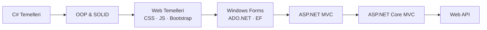

# 🚀 Skilled Hub 3 — Full Stack .NET Eğitim Yolculuğu

> C# temellerinden modern ASP.NET Core Web API'ye kadar uzanan, baştan sona uygulamalı bir **Full Stack .NET geliştirici** eğitiminin tüm proje ve örneklerini içeren depo.

<p align="center">
  
  
  
  
  
  
</p>

---

## 📖 Hakkında

Bu depo, **Skilled Hub 3** Full Stack .NET eğitimi boyunca işlenen tüm konuların kod örneklerini ve mini projelerini bir araya getirir. İçerik, bir geliştiricinin sıfırdan başlayıp adım adım ilerleyebileceği şekilde **temelden ileri seviyeye** doğru sıralanmıştır:

```
C# Temelleri  →  Nesne Yönelimli Programlama  →  Web Temelleri  →
Masaüstü (WinForms + Veritabanı)  →  ASP.NET MVC  →  ASP.NET Core MVC  →  Web API
```

Her klasör, bağımsız çalıştırılabilen bir Visual Studio projesidir ve ilgili konuyu izole örneklerle anlatır.

---

## 🗂️ İçindekiler

| # | Bölüm | Açıklama |
|---|-------|----------|
| 1 | [C# Temelleri & OOP](#-1-c-temelleri--nesne-yönelimli-programlama) | Değişkenlerden SOLID prensiplerine 18 konu |
| 2 | [Web Temelleri](#-2-web-temelleri) | CSS, JavaScript, jQuery, Bootstrap |
| 3 | [Masaüstü & Veritabanı](#-3-masaüstü-uygulamaları--veritabanı) | Windows Forms, ADO.NET, Entity Framework CRUD |
| 4 | [ASP.NET MVC](#-4-aspnet-mvc) | .NET Framework & .NET Core MVC |
| 5 | [Web API](#-5-aspnet-core-web-api) | RESTful servisler |

---

## 🧩 1. C# Temelleri & Nesne Yönelimli Programlama

Konsol uygulamaları üzerinden, dilin temellerinden başlayıp OOP ve yazılım prensiplerine kadar ilerleyen **18 konu**:

| Konu | İçerik |
|------|--------|
| `Konu01Degiskenler` | Değişkenler ve veri tipleri |
| `Konu02TipDonusumleri` | Tip dönüşümleri (casting / parsing) |
| `Konu03Operatorler` | Operatörler |
| `Konu04KararYapilari` | Karar yapıları (if / switch) |
| `Konu05Metotlar` | Metotlar ve parametreler |
| `Konu06Diziler` | Diziler |
| `Konu07Donguler` | Döngüler |
| `Konu08SiniflarClasses` | Sınıflar |
| `Konu09StructYapilar` | Struct yapıları |
| `Konu10StringSinifi` | String sınıfı ve metotları |
| `Konu11Enumlar` | Enum'lar |
| `Konu12KalitimInheritance` | Kalıtım (Inheritance) |
| `Konu13KapsullemeEncapsulation` | Kapsülleme (Encapsulation) |
| `Konu14InterfacesArayuzler` | Arayüzler (Interfaces) |
| `Konu15AbstractClasses` | Soyut sınıflar (Abstract Classes) |
| `Konu16CollectionsKoleksiyonlar` | Koleksiyonlar |
| `Konu17HataYonetimi` | Hata yönetimi (Exception Handling) |
| `Konu18SOLIDPrensipleri` | SOLID prensipleri |

---

## 🎨 2. Web Temelleri

`WebEgitimi/` klasörü altında, **40+ HTML örneği** ile ön yüz geliştirmenin temelleri:

- **CSS Eğitimi** — Arka planlar, margin/padding, boyutlandırma, `display`, `position`, `float` ve daha fazlası
- **JavaScript Eğitimi** — Operatörler, karar yapıları, döngüler, fonksiyonlar, string metotları, olaylar, diziler, seçiciler, DOM
- **jQuery** — Seçiciler, HTML/CSS manipülasyonu, DOM işlemleri, efektler, AJAX
- **Bootstrap Eğitimi** — Grid sistemi, hizalama, form elemanları, komponentler, tablo class'ları ve örnek tasarım

---

## 💻 3. Masaüstü Uygulamaları & Veritabanı

Windows Forms ile masaüstü uygulama geliştirme ve veritabanı işlemleri:

| Proje | Açıklama |
|-------|----------|
| `WindowsFormsEgitimi` | Windows Forms temel kontrolleri ve olayları |
| `WindowsFormsAppAdoNetCRUD` | **ADO.NET** ile doğrudan SQL üzerinden CRUD işlemleri |
| `WindowsFormsApp1EntityFrameworkCRUD` | **Entity Framework** ile ORM tabanlı CRUD işlemleri |

---

## 🌐 4. ASP.NET MVC

İki nesil MVC framework'ünün karşılaştırmalı eğitimi:

### `NetFrameworkMVCEgitimi` — Klasik ASP.NET MVC (.NET Framework 4.x)
Controller / View / Model yapısı, Razor view'lar ve klasik MVC mimarisi.

### `NetCoreMVCEgitimi` — Modern ASP.NET Core MVC (.NET 10)
Kapsamlı, **19 controller**'lık ileri seviye MVC eğitimi:

- Razor Syntax, HTML Helpers, Data Transfer (ViewBag/ViewData/TempData)
- Model Binding & Model Validation
- **CRUD** işlemleri, Section & Partial View'lar, View Result tipleri
- File Upload, Cookie & Session yönetimi, String formatlama
- `appsettings.json` kullanımı, **Filters**, HttpContext
- **Areas** (Admin, Blog, ApiKullanımı), **View Components**

---

## 🔌 5. ASP.NET Core Web API

`AspNetCoreWebAPI/` — .NET 10 üzerinde **RESTful Web API** geliştirme:

- Controller tabanlı API yapısı (`UyelerController`, `WeatherForecastController`)
- HTTP metotları (GET / POST / PUT / DELETE)
- Swagger / OpenAPI desteği

---

## 🛠️ Kullanılan Teknolojiler

| Katman | Teknolojiler |
|--------|--------------|
| **Dil** | C# |
| **Platform** | .NET 10, .NET Framework 4.7.2 / 4.8 |
| **Web** | ASP.NET Core MVC, ASP.NET MVC, ASP.NET Core Web API |
| **Veri** | Entity Framework, ADO.NET |
| **Masaüstü** | Windows Forms |
| **Ön Yüz** | HTML5, CSS3, JavaScript, jQuery, Bootstrap |
| **Araçlar** | Visual Studio, Git |

---

## ⚙️ Kurulum & Çalıştırma

```bash
# Depoyu klonlayın
git clone https://github.com/OrhanKaynak/SHubFullStack3.git
cd SHubFullStack3
```

1. `SHubFullStack3.slnx` çözüm dosyasını **Visual Studio** ile açın.
2. Çalıştırmak istediğiniz projeyi **Solution Explorer**'da sağ tıklayıp **Set as Startup Project** deyin.
3. `F5` ile derleyip çalıştırın.

> **Gereksinimler:** [.NET 10 SDK](https://dotnet.microsoft.com/download) ve güncel bir Visual Studio sürümü. Windows Forms ve .NET Framework projeleri için Windows ortamı gereklidir.

---

## 📈 Eğitim Yol Haritası



---

## 👤 Geliştirici

**Orhan Kaynak**
🔗 [github.com/OrhanKaynak](https://github.com/OrhanKaynak)

---

<p align="center">
  <sub>Skilled Hub 3 — Full Stack .NET Eğitimi kapsamında hazırlanmıştır. ⭐ Beğendiyseniz yıldız vermeyi unutmayın!</sub>
</p>
